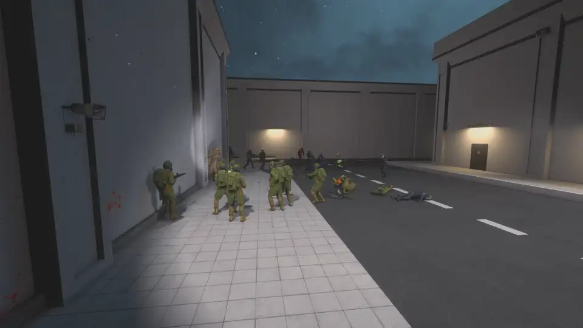
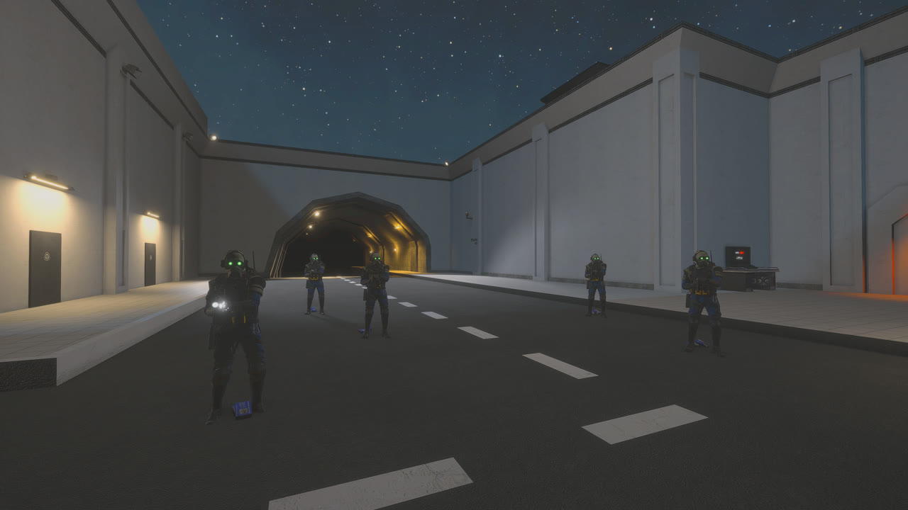
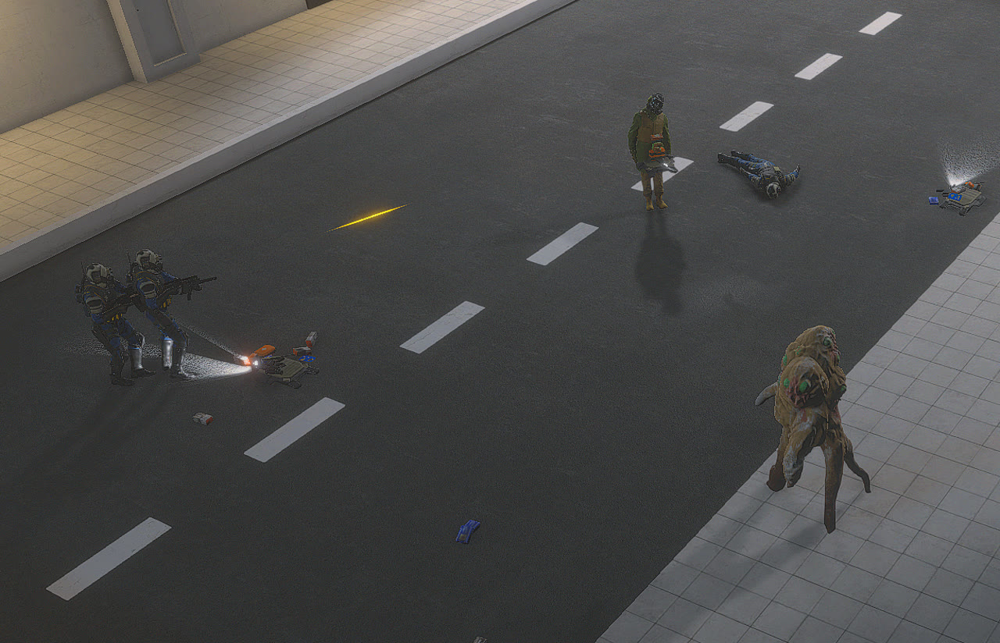

# SCPSLBot: AI players for SCP: Secret Laboratory

[](https://github.com/Michaelihc/scpsl-warmup-sandbox/releases/latest)


SCPSLBot fills an SCP: Secret Laboratory dedicated server with AI-controlled players. Every bot is a
native dummy, and the plugin drives it through the same systems a real player uses: it walks the
facility, opens doors, rides elevators, aims, shoots and reloads, and uses SCP abilities. Bots can play
any human role and every SCP except SCP-079.

SCPSLBot is a fork of [repkins/scpsl-bot-plugin](https://github.com/repkins/scpsl-bot-plugin) by
Antons Repins ([@repkins](https://github.com/repkins)), who created the bot framework it is built on.
See [Credits](#credits).



**[Download the latest release](https://github.com/Michaelihc/scpsl-warmup-sandbox/releases/latest)**.
This is the build that runs our production bot server.

## What the bots do

### SCPs

<!-- scp-gallery -->

| SCP | What the bot does |
|---|---|
| SCP-173 | Blinks toward its target and snaps necks only while nobody is watching. It drops tantrum at close range and uses Breakneck Speeds on long chases. |
| SCP-096 | Enrages at the first hostile it sees and tears into it. |
| SCP-049 | Uses Sense on its target and closes in for the kill. |
| SCP-049-2 | Hunts and claws humans. |
| SCP-106 | Hunts and attacks, and drags corroded victims into the pocket dimension. |
| SCP-939 | Hunts and claws humans. |
| SCP-3114 | Hunts and slaps humans. |
| SCP-079 | Not supported. SCP-079 has no body for a bot to drive. |

### Humans

- **Every armed role fights.** Bots choose targets by faction: the Foundation fights Chaos and Class-D,
  SCPs fight everyone, and everyone fights Tutorial. A bot fires the gun it carries (an unarmed
  bot is issued a COM-15), reloads when its magazine runs dry, strafes at mid range and backs off
  when rushed.
- **Class-D and Scientists try to escape.** They search floors, lockers and rooms for keycards,
  upgrade them in SCP-914, and work toward the exit through keycard doors and elevators.
- **Guards, NTF and Chaos patrol.** With no target in sight they roam their current zone.
- **Four difficulty levels.** `bot_difficulty easy|normal|hard|hardest` tunes fire rate, aim, strafing,
  how long bots chase a target they've lost, and SCP-096's rage.



### Navigation

- For every map seed, a navmesh is baked on the server from its real collision geometry. Changes
  to doors, admin toys and other geometry are rebuilt incrementally.
- Routing is keycard-aware: a Class-D never plans through a door its inventory cannot open, while
  a Scientist holding the right card does.
- Bots open doors, ride checkpoint and gate elevators, and jump across clutter in door-less connectors.
- Stuck recovery runs in escalating steps: nudge, jump, back off, re-plan, then avoid that crossing
  for 45 s.
- Custom maps built from static admin toys can be added to the navmesh (`nav rebuild <center> <size>`).



## Optional features

SCPSLBot also ships a warmup-server layer and two companion plugins. Each one is optional.

| Feature | What it adds | How to turn it on or off |
|---|---|---|
| **Standard warmup** | Rounds never end and everyone respawns. Players get three arenas, each with its own bot population: Surface PvE, HCZ/EZ PvPvE and LCZ SCP. Per-player menus let them respawn as any role, request items, teleport to rooms and switch arena. The warhead, decontamination, disarming, SCP-207 drain and native respawn waves are suppressed. | `warmup_mode: Standard` (default) or `None`; RA `bot_warmup standard\|none` |
| **WarmupSafezone** | Damage-free safezones at the Surface escape, SCP-914 and the Class-D cells. Inside, nobody deals or takes damage, grenades and SCP items can't be thrown, and in-world boundaries and signs are shown. Surface anti-camping applies too. | Install `WarmupSafezone.dll`; toggle with `enabled` |
| **StatsBots** | Records players' bot kills, a decayed combat skill rating, unlockable titles and a profile HUD. Requires [StatsSystem](https://github.com/MedveMarci/StatsSystem) 2.2. | Install `StatsBots.dll` |
| **Overflow cleanup** | Once loose items pile up, runs the native item/corpse/decal cleanup and repairs doors. | `enable_overflow_cleanup` (default `true`) |
| **Infinite ammo** | Reload-time reserve ammo so firefights never run dry. Third-party: [LabAPI_InfiniteAmmo](https://github.com/TASA-Ed/LabAPI_InfiniteAmmo). | Install the DLL |

### Bots only, without the warmup layer

No single setting turns everything off. `warmup_mode: None` disables the whole warmup layer, and
the remaining features have their own switches:

```yaml
# LabAPI/configs/<port>/SCPSLBot/config.yml
warmup_mode: None              # no round lock, respawns, arenas, managed population or hazard overrides
enable_overflow_cleanup: false # keep corpses (SCP-049 revives, SCP-3114 disguises) and broken doors
panel:
  enabled: false               # do not register the warmup Server-Specific Settings menu
```

Restart the server after changing `panel.enabled`. `bot_warmup none` switches the mode at runtime and
saves it to the config. Leave out `WarmupSafezone.dll` and `StatsBots.dll`, or disable them with
`is_enabled: false` in their `LabAPI/configs/<port>/<plugin>/properties.yml`.

In `None` mode you add the bots:

- `bot_add` spawns an AI bot (at most 10 at a time). Use native RA force-class to make it any role,
  SCPs included, and the AI takes over on the new role.
- Bots are removed on round restart.
- Dead bots are native spectators, so native NTF/Chaos waves can bring them back.
- Other plugins can spawn and command bots through the [plugin API](#plugin-api).

## Install

1. Download `SCPSLBot-<version>.zip` from the [latest release](https://github.com/Michaelihc/scpsl-warmup-sandbox/releases/latest).
2. Copy its folders into the LabAPI tree for your server port:

   | From the zip | To |
   |---|---|
   | `plugins/` (`SCPSLBot.dll`, `SCPSLBot.Components.dll`, `HsmAdapter.dll`) | `LabAPI/plugins/<port>/` |
   | `dependencies/` (`0Harmony.dll`, `ServerKeybinds.dll`) | `LabAPI/dependencies/<port>/` |
   | `optional/plugins/` (`WarmupSafezone.dll`, `StatsBots.dll`) | `LabAPI/plugins/<port>/`, only if you want them |

3. Install [HintServiceMeow](https://github.com/MeowServer/HintServiceMeow) for on-screen text. StatsBots
   also needs [StatsSystem](https://github.com/MedveMarci/StatsSystem) 2.2 and its `player_stats` store.
4. Choose a navigation backend (below) and start the server. `bot_status` reports readiness.

Install exactly one `ServerKeybinds.dll` per port, in the dependency folder that port's loader reads.
Never install a second copy or use `dependencies/global`. `HsmAdapter` and `ServerKeybinds` are open
source at [sl-plugins-cement/HsmAdapter](https://github.com/sl-plugins-cement/HsmAdapter) and
[Michaelihc/serverkeybinds](https://github.com/Michaelihc/serverkeybinds).

### Navigation backend

The default `navigation.backend: Runtime` bakes the navmesh from the server's real collision geometry.
A stock dedicated server ships its collider meshes unreadable (and streamed), so Unity's navmesh builder
silently drops most of the facility. Patch the server assets once per game update with the tools-only
patcher, then verify before every start:

```powershell
dotnet build tools\NavMeshAssetPatcher\NavMeshAssetPatcher.csproj -c Release
dotnet tools\NavMeshAssetPatcher\bin\Release\net8.0\NavMeshAssetPatcher.dll patch  --server "C:\Program Files (x86)\Steam\steamapps\common\SCP Secret Laboratory Dedicated Server"
dotnet tools\NavMeshAssetPatcher\bin\Release\net8.0\NavMeshAssetPatcher.dll verify --server "C:\Program Files (x86)\Steam\steamapps\common\SCP Secret Laboratory Dedicated Server"
```

What the patcher does:

- It rewrites `SCPSL_Data/*.assets` so every `Mesh` becomes readable with its vertex data inlined.
  The `.bak` originals stay beside them.
- It writes `SCPSL_Data/navmesh-asset-patch.json`, and `restore` puts the originals back.
- `verify` exits 2 when a game update or Steam file validation has restored the stock files.
  `tools\Start-BotTestServer8888.ps1`, the isolated 8891 drivers and the production deploy script
  refuse to start an unpatched server.
- Client files are never touched.

To skip patching, set `navigation.backend: Authored`. Bots then use the hand-authored navmesh embedded
in `SCPSLBot.dll`, which is what our production server runs.

## Quick start

| Goal | Command (Remote Admin) |
|---|---|
| Spawn an AI bot | `bot_add` |
| Make it an SCP or any other role | native force-class on the bot |
| Change bot skill | `bot_difficulty easy\|normal\|hard\|hardest` |
| Turn the warmup layer off/on | `bot_warmup none\|standard` |
| Check health and navigation | `bot_status`, `bot_health`, `nav status` |

## Reference

### Standard warmup

**Arenas and population.** Arena occupancy drives the managed bot population:

- LCZ occupancy keeps at least one SCP bot.
- HCZ/EZ occupancy keeps at least two human bots: one Foundation and one Chaos before any higher
  configured count.
- Surface keeps its classic player-factor population.
- Empty servers keep the configured baseline population.

Population-created bots stay reconciled to their role and arena. `bot_add` instead creates an
independent AI bot: RA role changes persist, because the population controller only adopts it when an
admin runs `bot_manage`.

**Arena entry and Surface rules.**

- Surface and LCZ placement use the game's native NTF Private and Class-D spawnpoints.
- HCZ/EZ entry rotates across distinct generated rooms. It uses the native named-door registry with
  the same collision-safe resolver as RA `doortp`, and falls back to SCP-939's native spawn if no door
  target is available.
- Surface PvE managed CI bots use their exact native CI reinforcement spawn.
- Real players may stay on Surface as Facility Guard or any NTF rank. Other human roles are evacuated
  to HCZ/EZ and SCPs to LCZ, each with a localized per-player broadcast.
- Only the native Gate A/Gate B Surface elevator doors receive a plugin-owned lock. It is removed
  when warmup is disabled.

**Respawns.** A round-owned service scans participating ready players every
`respawn_scan_interval_seconds`:

- Only the exact native `Spectator` role is eligible.
- A first-observed spectator respawns after `spectator_respawn_delay_ms`.
- A death from a playable role respawns after `human_respawn_delay_ms` and restores the previous role.
- Spectators are routed by their server-owned arena membership, not the spectator camera position.
- Failed native assignments stay scheduled and are retried with explicit logs.

Native spawn protection for real players is kept only on the first playable respawn after a confirmed
death. SCPSLBot clears native spawn protection on every bot it drives.

**Native waves.** Native reinforcement waves (NTF/CI main waves, mini-waves and forced waves) are
disabled during Standard warmup by default (`disable_native_respawn_waves_in_warmup: true`). Individual
player and bot respawns continue. Setting the option to `false`, switching warmup off or unloading
SCPSLBot releases the restriction without overwriting native timers or token counts.

**Tutorial.** Admin-assigned Tutorial is outside all warmup management. It keeps native spawning and
effects, adds nothing to arena population, has no warmup controls and is not protected by safezones.

### Player controls

While Standard warmup is active, Server-Specific Settings (SSS) provide personalized controls:

- **`Respawn as` + `Apply`.** The dropdown lists every registered native gameplay role except `None`,
  `Spectator`, `Destroyed`, `Overwatch`, `Filmmaker`, `CustomRole` and `Tutorial`. `Apply` performs
  the revalidated exact-role change. Role changes inside the facility keep the player's position.
- **`Request item` + `Grant`.** The dropdown lists the complete safe native item list. `Grant`
  rechecks full-UserId cooldowns and per-life/per-round limits before one native grant.
- **`Teleport room` + `Apply`.**
  - The dropdown stages a generated room from the native RA named-door registry.
  - Apply re-resolves the door tag with the same collision-safe calculation as RA `doortp`.
  - Surface destinations are hidden for every role. Apply rechecks the resolved zone, so a stale or
    forged selection cannot bypass that.
- **`Arena preset` + `Apply`.** Moves only that player to Surface PvE, HCZ/EZ PvPvE or LCZ SCP and
  applies the arena's default role. Selecting the active arena is a no-op for an alive player and
  respawns a spectator. A real switch commits only after the exact role and destination are verified,
  and otherwise rolls back.

How staging and refreshes behave:

- Opening or refreshing SSS performs no action. Dropdowns only stage a server-side selection; the
  explicit button executes it.
- A retained selection stays staged after it runs, so pressing the button again revalidates and
  repeats it.
- Staged selections use stable IDs tied to PlayerId, full UserId and action type. Each action type
  has its own monotonic per-user cooldown, so one action never delays another.
- Personalized refreshes are fingerprinted, targeted, debounced by 500 ms, spaced at least 2 s
  apart, and capped at six per player per minute.

Debug, bot-diagnostic and navigation-authoring tools are never sent to player SSS; they stay in Remote
Admin. StatsBots adds Display toggles and an unlocked-only title selector, with
`warmuptitle [list|none|<titleId>]` as the Player Console fallback.

### Navigation details

The runtime backend works in stages:

1. **Collect.** Two frames after map generation, it collects the live colliders the human capsule
   collides with. Players, door leaves and glass, pickups, ragdolls, elevator chambers, invisible
   doorway blockers, the Surface helicopter, the capybara and non-collidable admin toys are excluded.
2. **Build.** It builds asynchronously with the human capsule: radius 0.36 m plus 5 cm clearance,
   height 1.8 m, 0.3 m step, 45° slope, 9 cm voxels.
3. **Fill gaps.** Rooms whose meshes still cannot be read fall back to a probed floor
   (`NAV_ROOM_PROBED`).
4. **Link.** Each elevator group gets a bidirectional link between its landings. Door-less clutter
   connectors that the bake leaves sealed are probed with the capsule and bridged with a jump link.
   Connectors impassable at every tier log `NAV_CONNECTOR_SEALED` and are routed around.
5. **Keycard areas.** Keycard doors contribute one navmesh area per permission class
   (`navigation.keycard_area_routing`). Locked and unpowered doors are still handled when a bot
   interacts with them.

Keeping the navmesh current:

- The navmesh is reconciled with live geometry every `navigation.reconcile_interval_seconds` (5 s)
  and immediately after admin toys, room connectors or breakable doors change. Unchanged geometry
  costs only a source hash, and changed tiles rebuild asynchronously.
- When a bot reports a blocked crossing, that spot is carved out for
  `navigation.blocked_crossing_seconds` (45 s).
- A bake that fails twice on a map falls back to the authored backend for that map
  (`NAV_BAKE_FALLBACK`).
- Failed loads and bakes retry after 1, 2, 4 and 8 s, then every 15 s, until they succeed or the map
  changes. Managed bot spawning resumes once navigation is ready.

How bots move and recover:

- Bots follow string-pulled corners nudged into each turn and slide around whatever collider is
  directly ahead.
- When they stop making progress they escalate: door interaction and sideways nudges after 0.7 s,
  a native jump after 1.5 s, a short back-off, a re-plan after 2.5 s, then the crossing is carved out.
- Roam targets come only from reachable points. An unreachable goal produces a partial path toward
  the closest reachable point.

**Authored backend.** `navigation.backend: Authored` uses the embedded `Assets/navmesh.slnmf`, installed
on a fresh configuration. It quarantines invalid live nav data with backup recovery, fills rooms that
have no authored cells from live floor probes, and keeps the `nav` cell editor.

**Custom maps.**

- `nav rebuild <centerX> <centerY> <centerZ> <sizeX> <sizeY> <sizeZ>` re-bakes runtime navigation
  including one custom region.
- Load the geometry first, then wait for `nav status` to report `ready=True`, `built=True` and
  `active_backend=runtime`.
- Sizes are 1–1024 m on X/Z and 1–256 m on Y, within ±20,000 m on each axis.
- Only stationary toy hierarchies are baked: mark platforms and their parents `IsStatic=true`, and
  non-static parents exclude their children.
- A region lasts until round restart, new map generation, plugin unload or `nav rebuild clear`.

**Logs and status fields.**

- Server logs record `NAV_BAKE_START`, `NAV_BAKED`, `NAV_RECONCILE_START`, `NAV_RECONCILED`,
  `NAV_UNREADABLE_MESH`, `NAV_LINK`, `NAV_BAKE_FAILED`, `NAV_LOAD_RETRY` and `NAV_LOAD_RECOVERED`.
- Bot movement logs record `[BotNav] STUCK`, `CROSSING_PENALIZED`, `PLAN_FAILED`, `PLAN_PARTIAL` and
  `REPLAN_STORM`.
- `bot_status` exposes `nav_ready`, `nav_error`, `nav_backend` and the bake, link and reconcile counters.
  `nav status`, `nav probe` and `nav path` give the details.

### Remote Admin commands

| Command | Purpose | Permission |
|---|---|---|
| `bot_status` | Readiness, desired/tracked/owned/independent/live bots, nav generation, faults, runner heartbeat, resources | `FacilityManagement` |
| `bot_health` | Network registry recovery counters, last repair with object/component provenance, last scan fault; also available in the server console | `FacilityManagement` |
| `bot_add` | Spawn an independent AI bot (maximum 10); RA role changes persist | `PlayersManagement` |
| `bot_manage <player ID>` | Adopt an independent bot into a maintained population slot (Standard warmup); at full population it replaces one managed bot | `PlayersManagement` |
| `bot_unmanage <player ID>` | Release a maintained bot without despawning it; the controller creates a replacement | `PlayersManagement` |
| `bot_warmup [none\|standard]` | Query or change the persisted warmup mode | Query: none; change: `PlayersManagement` |
| `bot_difficulty [easy\|normal\|hard\|hardest]` | Query or change combat difficulty (default `hardest`, not persisted) | Query: none; change: `PlayersManagement` |
| `bot_path`, `botspike ...` | Pathing and native movement diagnostics | Mutation: `PlayersManagement`; spike status: `GameplayData` |
| `botspike survey <clutter\|doors\|all\|keycard> [both\|forward]`, `botspike survey_status`, `botspike survey_stop` | Walk the spike bot natively across every door-less connector (or plain door) and log per-case `[BotSurvey]` verdicts; `keycard` asserts keycard-aware routing with path queries only | Survey: `PlayersManagement`; status: `GameplayData` |
| `nav status` | Active/configured backend, readiness, bake and reconcile diagnostics | `GameplayData` |
| `nav rebuild` | Re-bake (runtime) or re-load (authored) navigation for the current map | `ServerConfigs` |
| `nav rebuild <center xyz> <size xyz>` / `nav rebuild clear` | Add or remove one custom-map region | `ServerConfigs` |
| `nav probe [x y z\|RoomName]` | Whether a point is on the navigation surface, the nearest surface point, navmesh area / door class | `GameplayData` |
| `nav path <from> <to> [perms <hex>\|all]` | Runtime path query between points or room anchors with a permission mask | `GameplayData` |
| `nav edit\|load\|save\|vertex ...` | Authored-backend cell editor | Read: `GameplayData`; mutation: `ServerConfigs` |
| `statsbots status\|grant\|revoke <fullUserId> ...` | Inspect or administer warmup titles | configurable `statsbots.manage` |

Notes:

- StatsBots admin commands require an exact full authenticated UserId.
- The native server-console `players` response counts humans only, including those still
  authenticating. It excludes the dedicated host and bots, so a LocalAdmin "restart when empty"
  policy treats a bot-only server as empty.
- Network registry monitoring checks for destroyed identities before network updates and when
  connections arrive.
  - With `enable_network_registry_recovery: true` (default), it removes only destroyed entries from
    Mirror's spawned, observing and ownership registries.
  - Repairs log `[BotHealth] DESTROYED_REGISTRY_ENTRY`.
  - Setting it to `false` keeps diagnostics without mutating the registries.

### Configuration

SCPSLBot defaults (`LabAPI/configs/<port>/SCPSLBot/config.yml`):

```yaml
language: ""                                   # "en", "cn", or "" (client language, Chinese fallback)
warmup_mode: Standard                          # Standard or None
default_warmup_mode: Standard                  # fallback when warmup_mode is invalid
disable_native_respawn_waves_in_warmup: true
human_respawn_delay_ms: 1200
bot_respawn_delay_ms: 2500
spectator_respawn_delay_ms: 5000
respawn_scan_interval_seconds: 0.5
warmup_bot_count: 3                            # 0-10
warmup_bot_role: ChaosRifleman
warmup_human_role: NtfPrivate
default_warmup_arena: SurfacePve
surface_pve_bot_factor: 1.2                    # 1-2
surface_pve_max_bot_count: 6                   # 2-6
heavy_entrance_pvpve_bot_count: 2              # 2-5
light_containment_scp_bot_count: 1             # fixed at 1
disable_warhead_in_warmup: true
disable_lcz_decontamination_in_warmup: true
disable_disarming_in_warmup: true
disable_scp207_health_drain_in_warmup: true
enable_overflow_cleanup: true                  # independent of warmup_mode
cleanup_item_threshold: 80
cleanup_check_interval_seconds: 10
enable_network_registry_recovery: true
force_standard_door_connectors: false
navigation:
  backend: Runtime                             # Runtime (needs the patched server assets) or Authored
  reconcile_interval_seconds: 5
  voxel_size: 0.09
  keycard_area_routing: true
  blocked_crossing_seconds: 45
panel:
  enabled: true                                # register the warmup SSS menu (read at plugin enable)
  show_arena_preset: true
  role_change_cooldown_seconds: 6
  item_grant_cooldown_seconds: 1
  teleport_cooldown_seconds: 1
  arena_switch_cooldown_seconds: 5
```

**Overflow cleanup.** `enable_overflow_cleanup` checks loose pickups on the configured interval. When
the count grows more than `cleanup_item_threshold` above the round baseline, it does the following,
then captures a new baseline:

- runs the game's native item, corpse, blood and bullet-hole cleanup;
- runs `repair **` for all repairable doors.

**`controls` and `panel`.**

- `controls` holds the item policy, native spawn-anchor overrides, the three arena presets, cooldown
  groups, allowed item roles and zones, and limits.
- `panel` holds the SSS presentation.
- High-impact items share a 60-second cooldown and are limited to one per life.

Each product exposes `language`. See [WarmupSafezone/README.md](WarmupSafezone/README.md) and
[StatsBots/README.md](StatsBots/README.md) for their full configuration.

Recommended native settings for a warmup server:

```yaml
auto_warhead_start_minutes: 0
dms_enabled: false
stamina_balance_use: 0
spawn_protect_enabled: true
```

### Plugin API

Other plugins can drive bots directly:

```csharp
using MapGeneration;
using PlayerRoles;
using SCPSLBot.AI;
using SCPSLBot.Api;

ReferenceHub bot = BotOrders.SpawnBot("Guard Bot", RoleTypeId.FacilityGuard);
BotOrders.MoveToRoom(bot, RoomName.HczArmory);   // or MoveTo(bot, worldPosition)
BotOrders.TryGetStatus(bot, out BotOrderStatus status);
BotOrders.Stop(bot);
BotOrders.DespawnBot(bot);

bool isBot = ManagedBotIdentity.IsManaged(player); // true for dummies SCPSLBot currently drives
```

On runtime navigation, `BotOrders.MoveTo` accepts either a floor point or the actor's native
standing-root position.

## Build and verify

```powershell
$env:SL_REFERENCES = 'C:\Program Files (x86)\Steam\steamapps\common\SCP Secret Laboratory Dedicated Server\SCPSL_Data\Managed'
dotnet build SCPSLBotAddon.sln -c Release -p:Platform=x64 -p:DeployToLocalServer=false
dotnet test SCPSLBot.PolicyTests\SCPSLBot.PolicyTests.csproj -c Release
node ..\.tests\lint-scenarios.js
```

Build notes:

- `ServerKeybinds` and `HsmAdapter` are project references, resolved from sibling checkouts.
  Override them with `-p:ServerKeybindsProject=<path>` and `-p:HsmAdapterProject=<path>`.
- Build deployment is opt-in. The production solution excludes the in-server test and reload plugins.

Verification:

- The navigation gates boot the isolated port 8891 against the patched server assets, and every
  driver verifies the asset patch first:
  - `python tests/playtest/tools/check_connector_survey.py --scenario scpslbot-runtime-navmesh-gate`
  - `--scenario scpslbot-keycard-routing-survey`
  - `--rounds 2`
  - `--scenario scpslbot-door-survey`

  See [tests/playtest/README.md](tests/playtest/README.md).
- The dedicated local bot-testing deployment is port `8888`. Start it with
  `tools\Start-BotTestServer8888.ps1`.

## Known conflicts and limits

**Install conflicts**

- Do not deploy the legacy `WarmupPlayerPanel` or `ScpslPluginStarter.dll`, or more than one
  `ServerKeybinds.dll` per port.
- `force_standard_door_connectors: true` rewrites map connectors and can conflict with map-layout
  plugins. It is off by default.

**Navigation**

- The runtime backend needs the patched dedicated-server assets, and a game update or Steam file
  validation restores the stock files. Bots stop at the Intercom doorway because its interior floor
  does not voxelize.

**Bot behaviour**

- SCP-079 has no bot AI.
- Generic SCP bots use their primary attack only: no SCP-049 revive, SCP-939 lunge, amnestic cloud
  or mimicry, SCP-106 stalk or portals, or SCP-3114 disguise or strangle.
- Bots do not use medkits, grenades or armor, and do not cuff.
- With no target in sight, bots on Surface hold position instead of roaming.

**Presentation**

- This suite never owns native badges or player names; StatsBots titles stay in its HSM profile.
- HSM text uses stable owned tags and never clears the shared vanilla hint and broadcast channels.

## Credits

SCPSLBot is a fork of **[repkins/scpsl-bot-plugin](https://github.com/repkins/scpsl-bot-plugin)** by
**Antons Repins ([@repkins](https://github.com/repkins))**, who created the project in 2023. He wrote the
foundation everything here builds on:

- the dummy-driven bot runtime;
- the goal-oriented AI mind (beliefs, goals and actions) and bot perception;
- movement and the original navigation mesh pathfinding, with its in-game navmesh editor;
- the first combat, door, elevator and item behaviours.

His commits make up most of this repository's history.

This fork adds the warmup layer, runtime navigation, SCP combat strategies, WarmupSafezone, StatsBots and
the later AI and stability work.

SCPSLBot is built with and alongside:

- [Harmony](https://github.com/pardeike/Harmony) by Andreas Pardeike (MIT) for runtime patching.
  `0Harmony.dll` ships in the release with its license.
- [AssetsTools.NET](https://github.com/nesrak1/AssetsTools.NET) by nesrak1 (MIT), used by the
  NavMeshAssetPatcher tool.
- [HintServiceMeow](https://github.com/MeowServer/HintServiceMeow) by MeowServer (MIT) for on-screen text.
- [StatsSystem](https://github.com/MedveMarci/StatsSystem) by MedveMarci, the player statistics store
  StatsBots uses.
- [LabAPI_InfiniteAmmo](https://github.com/TASA-Ed/LabAPI_InfiniteAmmo) by TASA-Ed Studio (Apache-2.0),
  recommended for warmup ammo.
- [LabAPI](https://github.com/northwood-studios/LabAPI) and SCP: Secret Laboratory by Northwood Studios.
