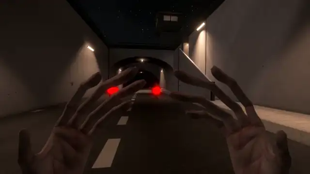
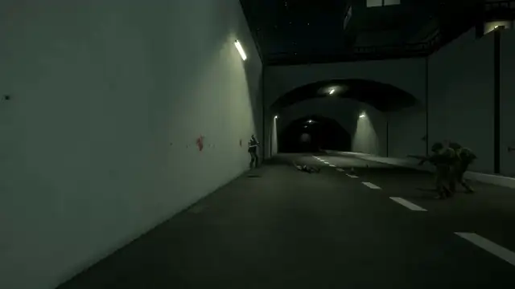
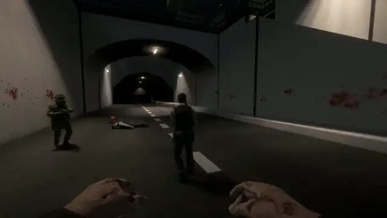
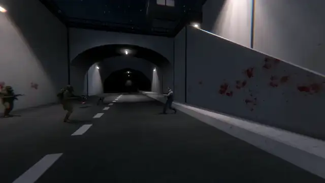
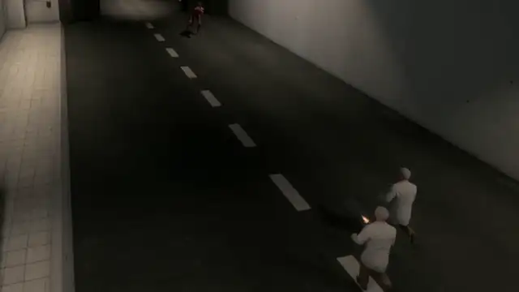
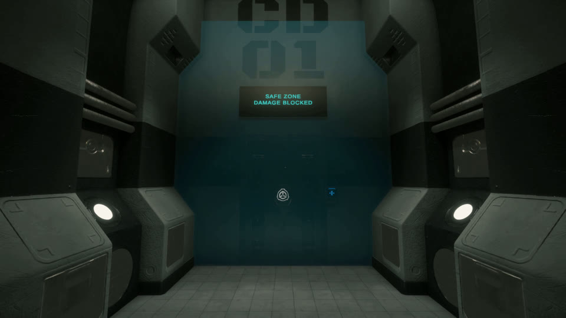
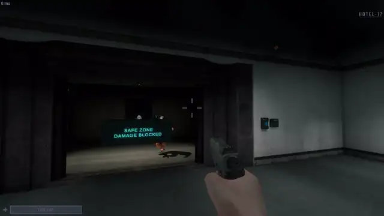

# SCPSLBot: AI players for SCP: Secret Laboratory

[](https://github.com/Michaelihc/scpsl-warmup-sandbox/releases/latest)


SCPSLBot fills an SCP: Secret Laboratory dedicated server with AI-controlled players. Every bot is a
native dummy, and the plugin drives it through the same systems a real player uses: it walks the
facility, opens doors, rides elevators, aims, shoots and reloads, and uses SCP abilities. Bots can play
any human role and every SCP except SCP-079.

SCPSLBot is a fork of [repkins/scpsl-bot-plugin](https://github.com/repkins/scpsl-bot-plugin) by
Antons Repins ([@repkins](https://github.com/repkins)), who created the bot framework it is built on.
See [Credits](#credits).


**[Download the latest release](https://github.com/Michaelihc/scpsl-warmup-sandbox/releases/latest)**.

## What the bots do

### SCPs

<table>
<tr>
<td width="50%"><br>
<b>SCP-173</b>: blinks toward its target and snaps necks only while nobody is watching. It drops tantrum at close range and uses Breakneck Speeds on long chases.</td>
<td width="50%"><br>
<b>SCP-096</b>: enrages at the first hostile it sees and tears into it.</td>
</tr>
<tr>
<td><br>
<b>SCP-049</b>: uses Sense on its target and closes in for the kill.</td>
<td><br>
<b>SCP-049-2</b>: hunts and claws humans.</td>
</tr>
<tr>
<td><br>
<b>SCP-106</b>: hunts and attacks, and drags corroded victims into the pocket dimension.</td>
<td><br>
<b>SCP-939</b>: hunts and claws humans.</td>
</tr>
<tr>
<td><br>
<b>SCP-3114</b>: hunts and slaps humans.</td>
<td><b>SCP-079</b> is not supported: it has no body for a bot to drive.</td>
</tr>
</table>

<sub>These are real-client clips of the release build, using runtime navigation at the hardest
difficulty. The SCP bots were invulnerable so that each take ran its full length.</sub>

### Humans

- **Every armed role fights.** Bots choose targets by faction: the Foundation fights Chaos and Class-D,
  SCPs fight everyone, and everyone fights Tutorial. A bot fires the gun it carries (an unarmed
  bot is issued a COM-15), reloads when its magazine runs dry, strafes at mid range and backs off
  when rushed.
- **Class-D and Scientists try to escape.** They search floors, lockers and rooms for keycards,
  upgrade them in SCP-914, and work toward the exit through keycard doors and elevators.
- **Guards, NTF and Chaos patrol.** With no target in sight they roam their current zone.
- **Four difficulty levels.** `bot_difficulty easy|normal|hard|hardest` tunes fire rate, aim, strafing,
  how long bots chase a target they've lost, and SCP-096's rage.


### Navigation

- For every map seed, a navmesh is baked on the server from its real collision geometry. Changes
  to doors, admin toys and other geometry are rebuilt incrementally.
- Routing is keycard-aware: a Class-D never plans through a door its inventory cannot open, while
  a Scientist holding the right card does.
- Bots open doors, ride checkpoint and gate elevators, and jump across clutter in door-less connectors.
- Stuck recovery runs in escalating steps: nudge, jump, back off, re-plan, then avoid that crossing
  for 45 s.
- Custom maps built from static admin toys can be added to the navmesh (`nav rebuild <center> <size>`).

How it works, the asset patch and the authored fallback: [docs/navigation.md](docs/navigation.md).


## Optional features

SCPSLBot also ships a warmup-server layer and two companion plugins. They are all off by default:
the `bots_only` master switch is `true`, so a fresh install runs plain AI bots in normal rounds.
Set `bots_only: false` in `LabAPI/configs/<port>/SCPSLBot/config.yml` and restart the server to turn the
features below on; each then follows its own setting.

| Feature | What it adds | Its own setting (with `bots_only: false`) |
|---|---|---|
| **Standard warmup** | Rounds never end and everyone respawns. Players get three arenas, each with its own bot population: Surface PvE, HCZ/EZ PvPvE and LCZ SCP. Per-player menus let them respawn as any role, request items, teleport to rooms and switch arena. The warhead, decontamination, disarming, SCP-207 drain and native respawn waves are suppressed. | `warmup_mode: Standard` (default) or `None`; RA `bot_warmup standard\|none` |
| **WarmupSafezone** | Damage-free safezones at the Surface escape, SCP-914 and the Class-D cells. Inside, nobody deals or takes damage, grenades and SCP items can't be thrown, and in-world boundaries and signs are shown. Surface anti-camping applies too. | Install `WarmupSafezone.dll`; toggle with `enabled` |
| **StatsBots** | Records players' bot kills, a decayed combat skill rating, unlockable titles and a profile HUD. Requires [StatsSystem](https://github.com/MedveMarci/StatsSystem) 2.2. | Install `StatsBots.dll` |
| **Overflow cleanup** | Once loose items pile up, runs the native item/corpse/decal cleanup and repairs doors. | `enable_overflow_cleanup` (default `true`) |
| **Infinite ammo** | Reload-time reserve ammo so firefights never run dry. Third-party: [LabAPI_InfiniteAmmo](https://github.com/TASA-Ed/LabAPI_InfiniteAmmo); not controlled by `bots_only`. | Install the DLL |

<table>
<tr>
<td width="50%"><br>
WarmupSafezone: the Class-D cells boundary and sign.</td>
<td width="50%"><br>
A shot fired inside the SCP-914 safezone is blocked.</td>
</tr>
</table>

### The `bots_only` master switch

```yaml
# LabAPI/configs/<port>/SCPSLBot/config.yml
bots_only: true   # default: plain AI bots; false turns on the warmup features above
```

With the switch on, SCPSLBot only runs bots: nothing above is active, the native `players` output and
other plugins' Server-Specific Settings menus are left alone, and bots ignore dummies they did not
create. Add bots with `bot_add` and make them any role, SCPs included, with native RA force-class.
Restart the server after changing the switch. Details: [docs/warmup.md](docs/warmup.md).

## Install

1. Download `SCPSLBot-<version>.zip` from the [latest release](https://github.com/Michaelihc/scpsl-warmup-sandbox/releases/latest).
2. Copy its folders into the LabAPI tree for your server port:

   | From the zip | To |
   |---|---|
   | `plugins/` (`SCPSLBot.dll`, `SCPSLBot.Components.dll`, `HsmAdapter.dll`) | `LabAPI/plugins/<port>/` |
   | `dependencies/` (`0Harmony.dll`, `ServerKeybinds.dll`) | `LabAPI/dependencies/<port>/` |
   | `optional/plugins/` (`WarmupSafezone.dll`, `StatsBots.dll`) | `LabAPI/plugins/<port>/`, only if you want them |

3. Install [HintServiceMeow](https://github.com/MeowServer/HintServiceMeow) for on-screen text. StatsBots
   also needs [StatsSystem](https://github.com/MedveMarci/StatsSystem) 2.2.
4. Pick a navigation backend: either patch the server assets once per game update for the default
   `Runtime` backend, or set `navigation.backend: Authored`. See [docs/navigation.md](docs/navigation.md).
5. Start the server; `bot_status` reports readiness.

Install exactly one `ServerKeybinds.dll` per port, never under `dependencies/global`. It keeps other
plugins' Server-Specific Settings and only touches the menu while the warmup controls or StatsBots are
active. `HsmAdapter` and `ServerKeybinds` are open source at
[sl-plugins-cement/HsmAdapter](https://github.com/sl-plugins-cement/HsmAdapter) and
[Michaelihc/serverkeybinds](https://github.com/Michaelihc/serverkeybinds).

## Quick start

| Goal | Command (Remote Admin) |
|---|---|
| Spawn an AI bot | `bot_add` |
| Make it an SCP or any other role | native force-class on the bot |
| Change bot skill | `bot_difficulty easy\|normal\|hard\|hardest` |
| Turn the warmup features on | set `bots_only: false` in the config and restart |
| Switch warmup modes (with `bots_only: false`) | `bot_warmup none\|standard` |
| Check health and navigation | `bot_status`, `bot_health`, `nav status` |

## Documentation

- [Warmup features](docs/warmup.md): the `bots_only` switch, arenas, respawns and the player menu
- [Navigation](docs/navigation.md): backends, the asset patcher, custom maps and diagnostics
- [Remote Admin commands](docs/commands.md)
- [Configuration](docs/configuration.md)
- [Plugin API](docs/plugin-api.md) for other plugins that spawn and command bots
- [Build and verify](docs/development.md)
- [Changelog](CHANGELOG.md)

## Known limits

- SCP-079 has no bot AI.
- Generic SCP bots use their primary attack only: no SCP-049 revive, SCP-939 lunge, amnestic cloud
  or mimicry, SCP-106 stalk or portals, or SCP-3114 disguise or strangle.
- Bots do not use medkits, grenades or armor, and do not cuff.
- With no target in sight, bots on Surface hold position instead of roaming.
- Do not install the legacy `WarmupPlayerPanel` or `ScpslPluginStarter.dll` alongside this suite.

## Credits

SCPSLBot is a fork of **[repkins/scpsl-bot-plugin](https://github.com/repkins/scpsl-bot-plugin)** by
**Antons Repins ([@repkins](https://github.com/repkins))**, who created the project in 2023. He wrote the
foundation everything here builds on:

- the dummy-driven bot runtime;
- the goal-oriented AI mind (beliefs, goals and actions) and bot perception;
- movement and the original navigation mesh pathfinding, with its in-game navmesh editor;
- the first combat, door, elevator and item behaviours.

His commits make up most of this repository's history.

This fork adds the warmup layer, runtime navigation, SCP combat strategies, WarmupSafezone, StatsBots and
the later AI and stability work.

SCPSLBot is built with and alongside:

- [Harmony](https://github.com/pardeike/Harmony) by Andreas Pardeike (MIT) for runtime patching.
  `0Harmony.dll` ships in the release with its license.
- [AssetsTools.NET](https://github.com/nesrak1/AssetsTools.NET) by nesrak1 (MIT), used by the
  NavMeshAssetPatcher tool.
- [HintServiceMeow](https://github.com/MeowServer/HintServiceMeow) by MeowServer (MIT) for on-screen text.
- [StatsSystem](https://github.com/MedveMarci/StatsSystem) by MedveMarci, the player statistics store
  StatsBots uses.
- [LabAPI_InfiniteAmmo](https://github.com/TASA-Ed/LabAPI_InfiniteAmmo) by TASA-Ed Studio (Apache-2.0),
  recommended for warmup ammo.
- [LabAPI](https://github.com/northwood-studios/LabAPI) and SCP: Secret Laboratory by Northwood Studios.
